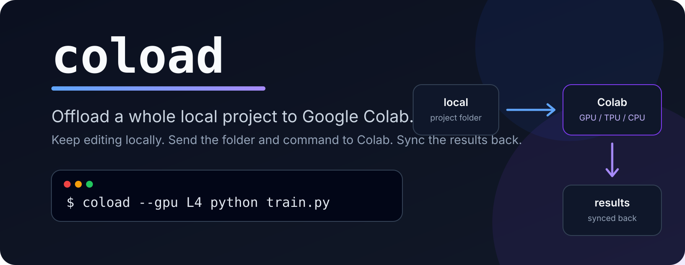
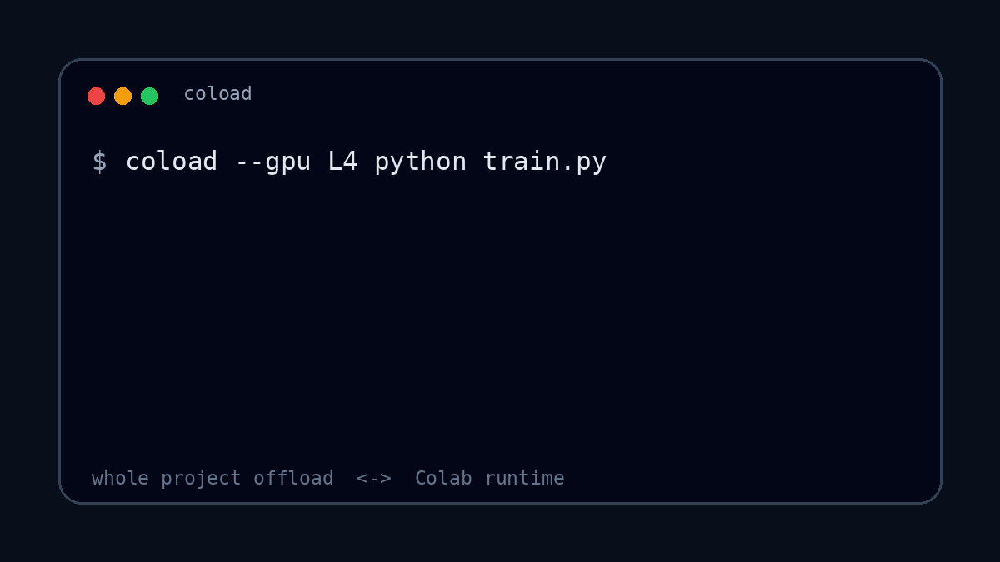

<p align="center">
  
</p>

<h1 align="center">coload</h1>

<p align="center">
  <strong>Offload your whole local project to Google Colab.</strong>
</p>

<p align="center">
  Keep coding locally. Run the project on Colab compute. Sync the results back automatically.
</p>

<p align="center">
  
</p>

## Install

```bash
curl -fsSL https://raw.githubusercontent.com/autkucakan/coload/main/install.sh | bash
```

Then, from any local project:

```bash
cd ~/workspace/my-project
coload --gpu L4 python train.py
```

<p align="center">
  
</p>

## Whole-project Colab offloading

Google's `colab run` uses a local Python script as the unit of work:

```bash
colab run --gpu L4 train.py
```

`coload` uses your project folder as the unit of work:

```bash
cd my-project
coload --gpu L4 python train.py
```

| | `colab run` | `coload` |
| --- | --- | --- |
| Unit of work | Python script | Project directory |
| Project files | Script is sent for execution | Working directory is synced |
| Command | Python script | Arbitrary command |
| Remote changes | Not a project sync workflow | Synced back locally |
| Runtime lifecycle | Automatic | Automatic |

Use `coload` when the code you want to offload is a real project rather than a self-contained script.

## How offloading works

For every run, `coload`:

1. starts a temporary Colab runtime;
2. offloads the current project to `/content/project`;
3. runs your command inside that project;
4. streams the command output to your terminal;
5. syncs remote changes back to your local project;
6. releases the Colab runtime.

Your editor, Git repository, and normal development workflow stay local.

If the command fails or is interrupted, `coload` still attempts to sync changes back and release the runtime.

## Runtime options

```bash
# T4 by default
coload python train.py

# Choose another GPU
coload --gpu L4 python train.py
coload --gpu A100 python train.py

# CPU
coload --cpu python script.py

# TPU
coload --tpu v6e1 python train.py

# Request high-memory compute
coload --gpu A100 --high-mem python train.py
```

| Option | Runtime |
| --- | --- |
| default | T4 GPU |
| `--gpu T4` | NVIDIA T4 |
| `--gpu L4` | NVIDIA L4 |
| `--gpu G4` | G4 |
| `--gpu A100` | NVIDIA A100 |
| `--gpu H100` | NVIDIA H100 |
| `--tpu v5e1` | TPU v5e1 |
| `--tpu v6e1` | TPU v6e1 |
| `--cpu` | CPU |
| `--high-mem` | High-memory runtime when available |

Accelerator availability depends on your Google Colab account, quota, plan, and Google's available capacity.

## What gets offloaded

The current directory is synchronized to the Colab runtime.

Common local-only directories are excluded:

```text
.git/
.venv/
__pycache__/
node_modules/
```

Files created or changed during the remote command are synchronized back afterward.

## Installation details

The installer sets up:

- `uv`, when needed
- Python 3.12
- Google's Colab CLI
- a dedicated SSH key at `~/.ssh/coload_ed25519`
- `coload` at `~/.local/bin/coload`
- Google Colab authentication

It does not replace your existing SSH keys.

You can also install from source:

```bash
git clone https://github.com/autkucakan/coload.git
cd coload
./install.sh
```

## Requirements

`coload` currently targets Linux.

You need:

- a Google account with Colab access
- OpenSSH
- `rsync`
- `curl` or `wget`

## Scope

`coload` is focused on one workflow:

**offloading whole local projects to Google Colab compute.**

It is not intended to become a general cloud GPU platform or multi-provider compute abstraction.

## Status

`coload` is an early open-source project built on Google's Colab CLI. Changes to the underlying Colab CLI may require corresponding updates.

## License

MIT
