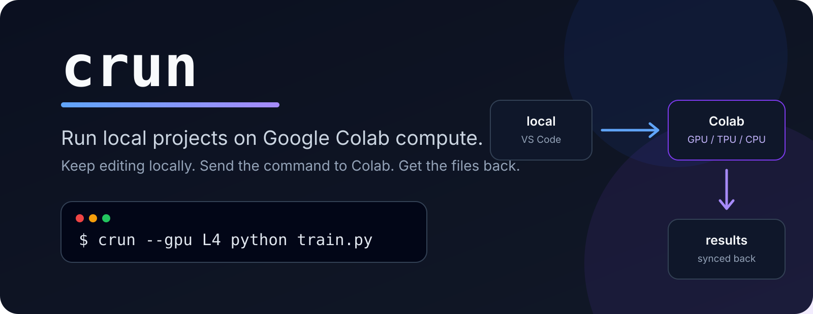
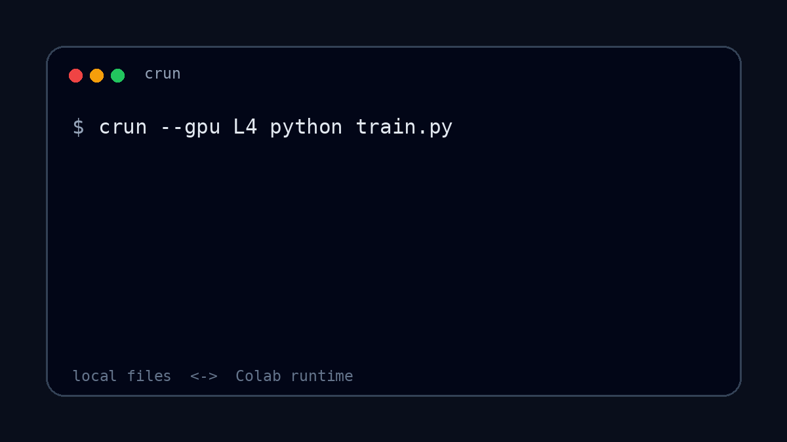

<p align="center">
  
</p>

<h1 align="center">crun</h1>

<p align="center">
  Run commands from a local project on Google Colab compute.
</p>

<p align="center">
  
</p>

## Start here

```bash
git clone https://github.com/autkucakan/crun.git
cd crun
./install.sh
```

Then use `crun` from any local project:

```bash
cd ~/workspace/my-project
crun python train.py
```

Choose the runtime when you need something different:

```bash
crun --gpu L4 python train.py
crun --gpu A100 python train.py
crun --cpu python script.py
crun --tpu v6e1 python train.py
```

<p align="center">
  
</p>

## What it does

You keep the project in your normal local folder and edit it with VS Code.

For each run, `crun`:

1. starts a temporary Colab runtime;
2. syncs the current project to `/content/project`;
3. runs your command there and streams its terminal output;
4. syncs the remote project back to the local folder;
5. stops the Colab runtime.

If the command fails or is interrupted, `crun` still attempts to sync the files back and release the runtime.

## Runtime options

| Option | Runtime |
| --- | --- |
| default | T4 GPU |
| `--gpu T4` | NVIDIA T4 |
| `--gpu L4` | NVIDIA L4 |
| `--gpu G4` | G4 |
| `--gpu A100` | NVIDIA A100 |
| `--gpu H100` | NVIDIA H100 |
| `--tpu v5e1` | TPU v5e1 |
| `--tpu v6e1` | TPU v6e1 |
| `--cpu` | CPU |
| `--high-mem` | Requests a high-memory runtime when supported |

Runtime availability still depends on your Colab account, quota, plan, and Google's current capacity.

## Example

```python
# test_gpu.py
import torch

print("CUDA available:", torch.cuda.is_available())
if torch.cuda.is_available():
    print("Device:", torch.cuda.get_device_name(0))
```

Run it from the same local folder:

```bash
crun --gpu L4 python test_gpu.py
```

## Files that stay local

`crun` skips common directories that should not be copied to the runtime:

```text
.git/
.venv/
__pycache__/
node_modules/
```

Everything else in the current directory is synchronized before the command runs. Files created or changed remotely are synchronized back afterward.

## Installation details

`install.sh` sets up the pieces `crun` needs:

- `uv`, if it is missing
- Python 3.12
- Google Colab CLI
- a dedicated SSH key at `~/.ssh/crun_ed25519`
- `crun` in `~/.local/bin`
- Google Colab authentication

The installer does not replace your existing SSH keys.

## Requirements

`crun` currently targets Linux.

The machine needs OpenSSH, `rsync`, and either `curl` or `wget`. You also need a Google account with Colab access.

## Colab usage

Starting a runtime consumes Colab resources according to your account and plan. `crun` stops the runtime after the command exits instead of leaving it running intentionally.

GPU and TPU availability is controlled by Google Colab.

## Status

`crun` is an early project built on the Google Colab CLI. Colab CLI changes may require updates here.

## License

MIT
